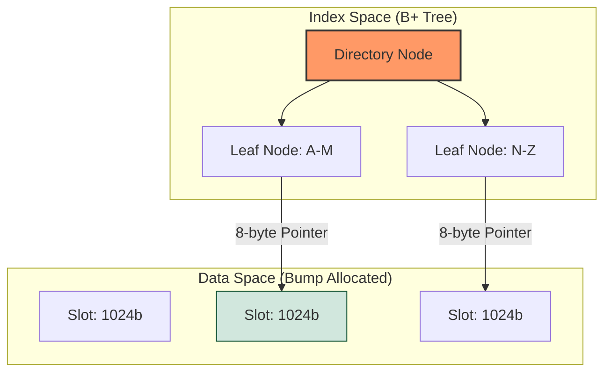
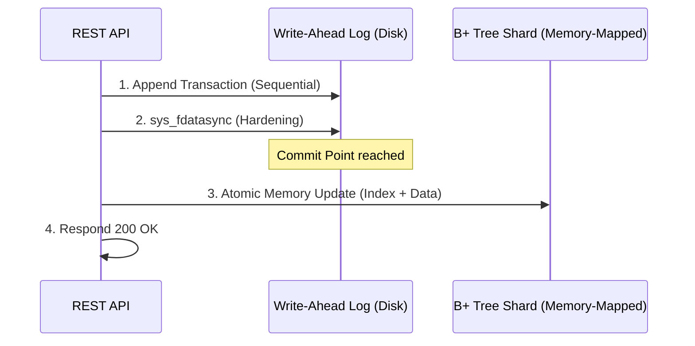
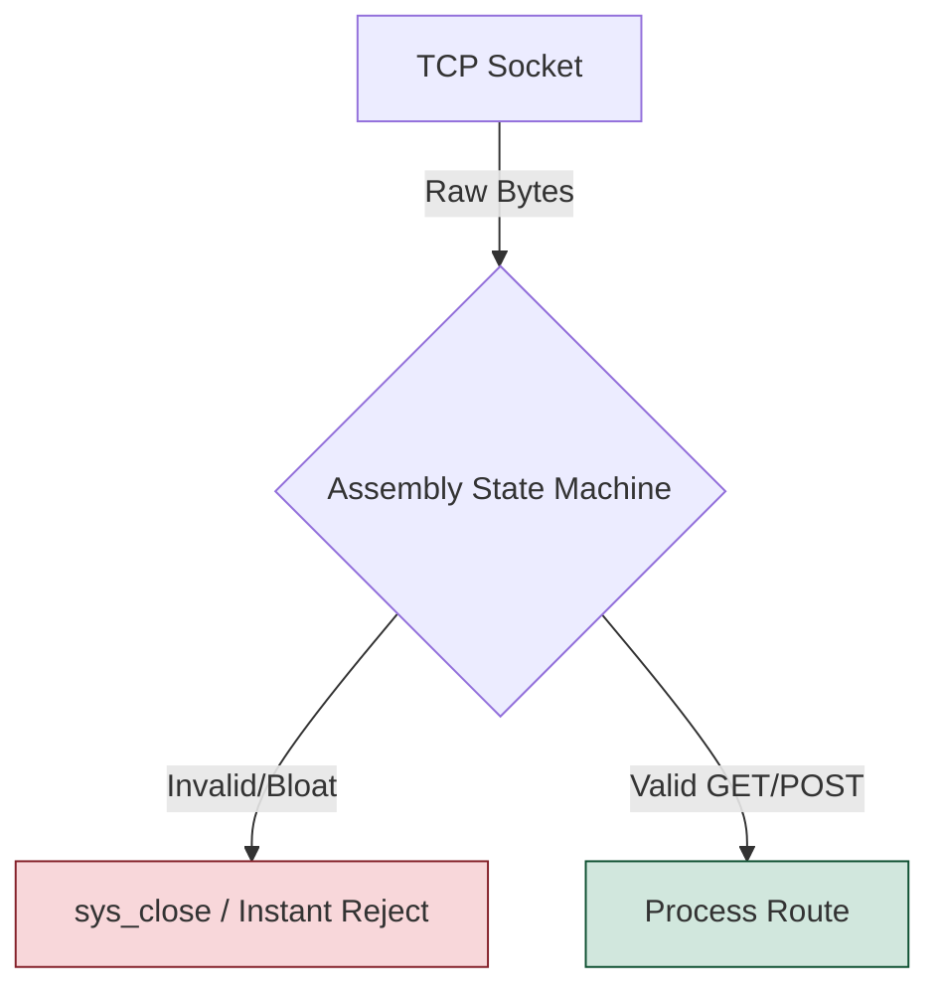

# Architecture of La Roca: From the Metal Up

La Roca Micro-KV is a study in uncompromising efficiency. In an era of bloated runtimes, this document explores the low-level mechanics—from raw syscall routing to deterministic memory geometry—that allow a 10KB x86_64 Assembly engine to deliver hardware-accelerated security and crash-resilient integrity from the metal up.

---

## 1. The Geometry of Zero: Index/Data Separation & B+ Trees

In modern high-level languages, memory management is often a black box handled by garbage collectors or complex allocators. In **La Roca**, we discarded the box entirely. To achieve a 10KB binary footprint without sacrificing speed, we replaced flat arrays with an ultra-optimized **Index/Data Separation Architecture** powered by B+ Trees.

### 1.1 The Death of Malloc/Free: Bump Allocation & O(log N) Access
Dynamic memory allocation is the enemy of predictable latency. In Assembly, every call to a heap allocator introduces fragmentation risks and non-deterministic execution paths.

La Roca splits its shards into two distinct physical realms managed without `libc`:
* **The Data Space (Append-Only):** Records are written sequentially into fixed **1024-byte (1KB) slots** using a lightning-fast *Bump Allocator*. Data never moves once written.
* **The Index Space (B+ Tree):** To find records instantly, a 2-Level B+ Tree stores the 32-byte Keys and an 8-byte absolute memory pointer to the Data Slot.

By separating the index from the payload, an update to an existing key is a simple $O(1)$ **In-Place Pointer Swap** in the B+ Tree, bypassing the need to move megabytes of data.

### 1.2 Cache Locality & 256KB Mega-Pages
Modern CPUs are only as fast as their cache hits. A standard B-Tree using 4KB OS pages forces the CPU to chase pointers across deep branches, ruining the L1/L2 cache.

La Roca solves this using **Mega-Pages**.
* **Massive 256KB Nodes:** A single B+ Tree node in La Roca is 256KB, capable of holding up to **6,553 keys**. This allows the engine to store millions of records per shard with a maximum tree depth of 2.
* **Hardware Alignment:** Data slots remain strictly 1KB. This ensures every payload is perfectly aligned with CPU Cache Lines (64 bytes), allowing the CPU’s hardware prefetcher to load data with surgical precision without straddling page boundaries.
* **Linked Leaves (Range Scans):** B+ Tree leaves contain pointers to their siblings (`NODE_OFFSET_NEXT`). When performing a range scan, the engine finds the first key and simply sweeps contiguous memory horizontally, completely ignoring the tree structure above it.

### 1.3 Spatial Safety: Security via Architectural Geometry
In high-level languages like C, buffer overflows are a constant threat due to manual heap management and "soft" boundary checks. In **La Roca**, security is enforced by the **geometry of the system itself**.

* **Bump Allocator Boundaries:** The allocator tracks a single `Next Free Pointer`. Before any 1KB slot or 256KB Mega-Page is allocated, the engine uses register-level bounds checking against the hardcoded 64MB shard limit. If `Pointer + Requested_Size > 64MB`, the allocation is rejected at the hardware level.
* **Heap-less Sandboxing:** By eliminating dynamic allocation, we’ve effectively removed the most common attack vectors: Heap Spraying and Use-After-Free (UAF) vulnerabilities. There is no "free" list to corrupt.
* **Memory-Mapped Isolation:** Each shard is mapped into its own rigid memory segment. The fixed architecture acts as a physical cage; a process writing to a specific key has no architectural path to reach the engine's internal instruction pointers or syscall tables.

---

## 2. Write-Ahead Logging (WAL): Sequential Durability

Persistence is meaningless if data is corrupted during a crash. To guarantee atomic durability without the overhead of heavy journaling file systems, La Roca implements a low-level **Write-Ahead Log (WAL)**.

### 2.1 The WAL-First Commit Protocol
Before any modification touches the main memory-mapped shards, a transaction record is serialized and appended to the WAL. The engine invokes `sys_fdatasync` to ensure the log is physically hardened to the storage medium before proceeding.
* **Sequential I/O Advantage:** Unlike shard updates which may involve random access across the B+ Tree, WAL operations are strictly append-only. This maximizes write-combining efficiency on modern NVMe drives.
* **The Source of Truth:** The main shards are treated as a "volatile cache" of the disk state. If a `SIGKILL` occurs, the engine treats the WAL as the only absolute authority.

### 2.2 Hardware-Accelerated Integrity (CRC32)
Software-based hashes (like MD5 or SHA) introduce a significant latency penalty that contradicts the "Zero-Libc" philosophy. **La Roca** delegates data integrity to the CPU's silicon.

* **SSE4.2 Hardware Acceleration:** We use the native `CRC32` opcode. This instruction processes data at the register level, calculating the checksum of a 1KB slot in approximately 10-20 CPU cycles.
* **End-to-End Data Integrity:** At write, the CRC32 is calculated and stored in the WAL. During recovery, the engine re-calculates the checksum on-the-fly. If a mismatch is detected, the engine halts to prevent **Silent Data Corruption**.

### 2.3 The "Immortal" Recovery Cycle
The reason La Roca can safely utilize `stop_signal: SIGKILL` in containerized environments is its specialized, hardware-verified boot sequence.

1. **Cold-Audit (WAL Scanning):** Upon startup, the engine scans the `wal.log` and audits the CRC32 signatures of every 1KB block.
2. **Deterministic Replay:** The engine parses valid operations (SET/DELETE) and re-executes them directly into the memory-mapped shards, perfectly rebuilding the B+ Tree.
3. **Idempotency:** If a transaction was interrupted (a "Torn Write"), the CRC32 check fails, and the partial block is ignored. The recovery process is idempotent and can be interrupted infinitely without leaving the database in an inconsistent state.

---

## 3. The Syscall Router: Life without Libc

Most modern applications rely on a thick layer of abstractions provided by the C Standard Library (`libc`). **La Roca** bypasses this entirely, communicating directly with the Linux kernel via the `syscall` instruction. This **"Zero-Libc"** approach is the secret behind our 10KB footprint and near-zero startup time.

### 3.1 Direct Kernel Interface (DKI) & Static Purity
By eliminating the dependency on `libc.so` or `musl`, we achieve a level of binary purity that is rare in modern software.
* **Instruction-Level Control:** Every operation—from file I/O to memory mapping—is triggered by manually setting up the CPU registers (`rax`, `rdi`, `rsi`, etc.) and executing the `syscall` opcode.
* **Immunity to "Dependency Hell":** Since the binary is 100% static and unlinked, it carries no baggage. It will run on any Linux kernel (x86_64) regardless of the distribution.

### 3.2 High-Performance Networking (Zero-Copy Intent)
The networking stack is built on the raw Berkeley Sockets API provided by the kernel, optimized for the lowest possible latency and minimal context-switching.

* **Raw Socket Lifecycle:** The engine manually invokes `sys_socket`, `sys_bind`, and `sys_listen`. When a connection arrives, `sys_accept` provides a file descriptor processed without any high-level "Stream" abstractions.
* **Memory-Network Synergy:** Data received from the network is read directly into our pre-allocated buffers. By eliminating intermediate buffering, we drastically reduce CPU cycle consumption per request.

### 3.3 The Assembly HTTP Parser: Attack Surface Reduction
General-purpose HTTP parsers are often multi-megabyte liabilities prone to complex exploits. La Roca uses a **Minimalist State Machine** written in pure Assembly.

* **Byte-by-Byte Scanning:** Instead of using expensive string functions, the engine scans the input buffer in a single pass using the `lodsb` instruction.
* **Security by Omission:** By not implementing 99% of unnecessary HTTP specifications, we eliminate entire classes of vulnerabilities (e.g., Request Smuggling).
* **The "Drop-on-Error" Policy:** If the incoming bytes do not strictly match our expected REST verbs, the engine triggers an immediate `sys_close`. This makes the engine an extremely small and "hard" target.

---

## 4. Engineering with an "Alien" Junior (The AI Methodology)

Building a production-ready database in pure x86_64 Assembly in 2026 is often considered a "lost art." **La Roca** was developed using a symbiotic methodology between a Senior Systems Architect and a high-reasoning AI agent. This approach allowed us to scale development speed without compromising the microscopic precision required for low-level engineering.

### 4.1 Modular Assembly & Context Isolation
To eliminate the "hallucinations" common in AI-generated code, we employed a **Modular Assembly** strategy. We treated the AI as a specialized Junior Engineer tasked with implementing atomic, strictly-defined modules.

* **Context Pinning:** Instead of asking for a "database," the Architect provided the AI with specific register maps and syscall constraints. This limited the AI's "creative" search space to pure logic.
* **Instruction-Level Audit:** By isolating context, the Architect could verify the logic of each module (instruction by instruction) before integration, ensuring no "bloat" or hidden overhead was introduced.

### 4.2 Test-Driven Assembly (TDA) & Validation
In the absence of a high-level compiler's safety nets, we relied on a rigorous **Test-Driven Assembly** workflow. Every module generated by the "Alien Junior" had to pass a gauntlet of automated simulations:
1. **The Behavioral Spec:** The Architect defined the exact input/output state of the registers.
2. **Stress Testing:** Modules were subjected to high-concurrency and "malformed input" tests.
3. **Corruption Resilience:** The WAL and CRC32 modules were validated using scripts that simulate sudden power loss and bit-flips.

### 4.3 Human Oversight: The "Final Byte" Rule
While the AI was instrumental in exploring logic patterns and generating boilerplate, the **BlockMaker** philosophy mandates that a human architect performs the final audit.
* **Micro-Optimization:** A human identifies where a `MOV` can be replaced by a `XOR` or where a jump can be optimized for the CPU's branch predictor.
* **Strategic Security:** The Architect ensures that every syscall return value is handled and that the engine's "Spatial Safety" remains uncompromised.

---

## 5. Future Horizons: The BlockMaker Roadmap

La Roca is designed to be the bedrock of a new generation of hyper-efficient infrastructure. Our roadmap for 2026 focuses on expanding hardware-level capabilities while maintaining our strictly minimal footprint.

* **🔒 AES-NI Integration (Q2 2026):** Implementing at-rest encryption using native Intel/AMD AES instructions. This will provide military-grade security with near-zero CPU overhead.
* **🌍 Aarch64 Porting:** Bringing La Roca’s 10KB efficiency to ARM64 architectures, targeting Apple Silicon and high-density Graviton cloud instances.
* **⚡ SIMD-Accelerated Search:** Leveraging **AVX-512** instructions to perform parallel pattern matching across multiple data shards simultaneously.
* **📡 io_uring Support:** Transitioning from standard syscalls to Linux `io_uring` for asynchronous, high-throughput I/O operations without the context-switch penalty.
* **📊 Assembly-Native Metrics:** A built-in Prometheus-compatible exporter written in pure Assembly to provide real-time observability into engine internals.

---

## 🛡️ Engineered by BlockMaker

**La Roca** is more than a storage engine; it is a statement against software bloat and a return to deterministic, instruction-level engineering.

* **Design & Architecture:** Fernando E. Mancuso & BlockMaker Engineering
* **Organization:** [BlockmakerCompany](https://github.com/BlockmakerCompany)
* **Release:** March 2026 | Stable Build 1.0.0
* **Inquiries:** For industrial integration or low-level consulting, reach out via [GitHub Issues](https://github.com/BlockmakerCompany/la-roca-micro-kv/issues).

> *"If it requires a library, it doesn't belong in the core."* > — **The BlockMaker Manifesto**

---

## 🛡️ Lead Architect

**Fernando Ezequiel Mancuso** *Systems Architect & Low-Level Specialist* [LinkedIn Profile](https://www.linkedin.com/in/fernando-ezequiel-mancuso-54a2737/)

> "The distance between the metal and the code is where true efficiency lives."
> — **BlockMaker Philosophy**