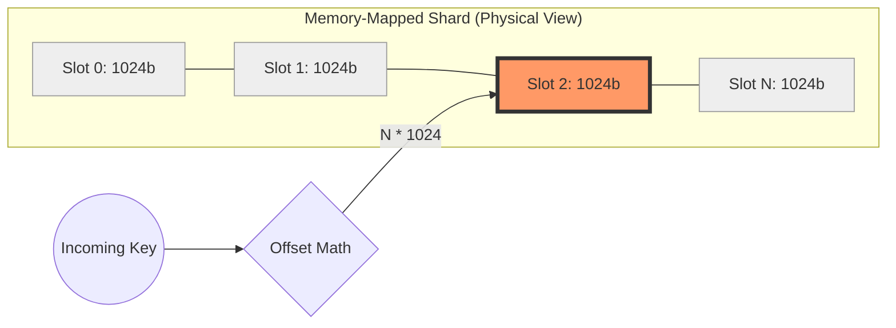
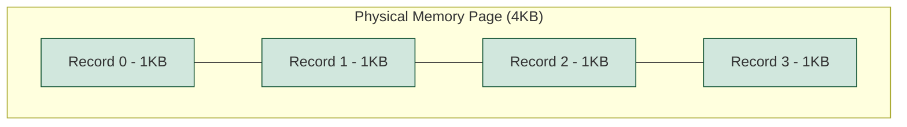
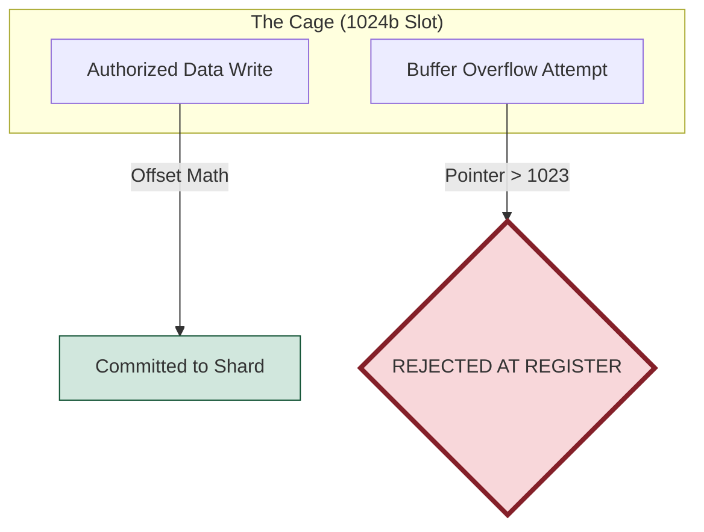
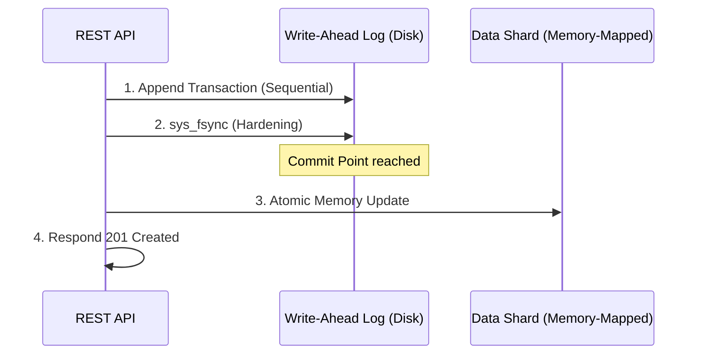
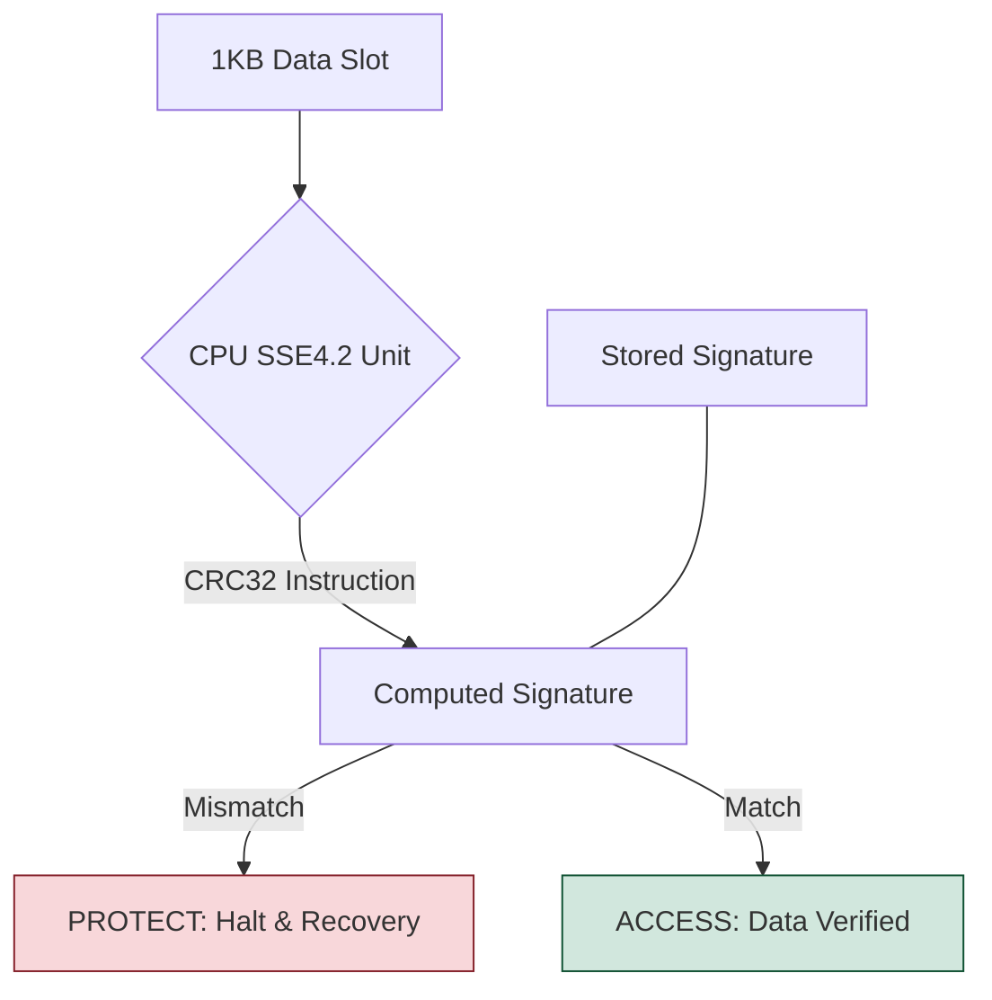
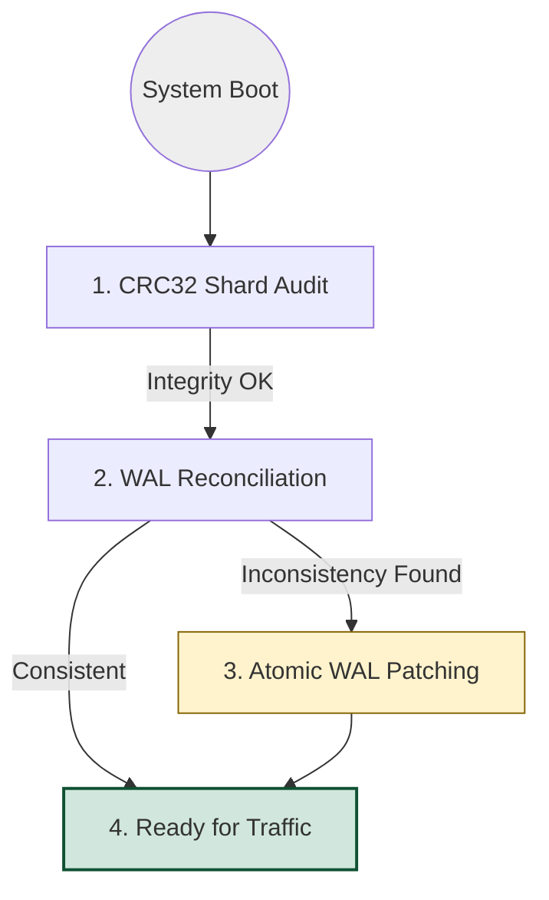
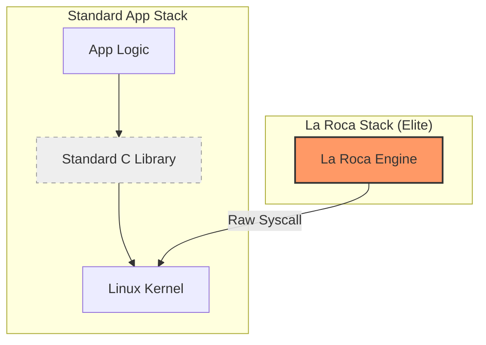
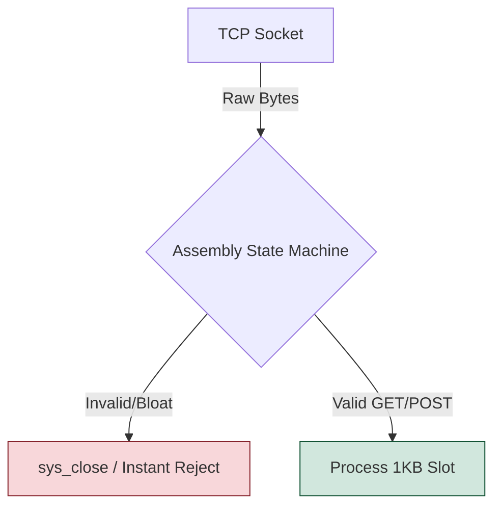
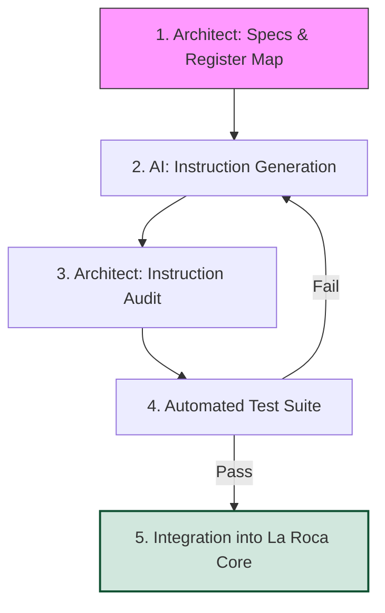

# Architecture of La Roca: From the Metal Up

La Roca Micro-KV is a study in uncompromising efficiency. In an era of bloated runtimes, this document explores the low-level mechanics—from raw syscall routing to deterministic memory geometry—that allow a 10KB x86_64 Assembly engine to deliver hardware-accelerated security and crash-resilient integrity from the metal up.

---

## 1. The Geometry of Zero: Deterministic Memory & O(1) Access

In modern high-level languages, memory management is often a black box handled by garbage collectors or complex allocators. In **La Roca**, we discarded the box entirely. To achieve a 10KB binary footprint without sacrificing speed, we embraced **Deterministic Memory Geometry**.

### 1.1 The Death of Malloc/Free
Dynamic memory allocation is the enemy of predictable latency. In Assembly, every call to a heap allocator introduces fragmentation risks and non-deterministic execution paths.

La Roca operates on a **Fixed-Slot Architecture**. Every record is strictly mapped to a **1024-byte (1KB) slot**.
* **Zero Overhead:** We eliminated the need for `malloc`, `free`, and the entire `libc` memory management suite.
* **O(1) Access:** Finding a record is a simple bit-shift operation. To access the $N^{th}$ record, the engine calculates the offset as:
  `Offset = N * 1024`
  This calculation is performed at the CPU register level, bypassing complex lookup tables and providing true constant-time access.
  

### 1.2 Cache Locality & Hardware Alignment
Modern CPUs are only as fast as their cache hits. By enforcing a 1KB slot size, we ensure that every record is perfectly aligned with both **CPU Cache Lines (64 bytes)** and **Memory Pages (4KB)**.

* **L1/L2 Optimization:** Since 1KB is a power of two and a multiple of 64, records never straddle cache line boundaries unnecessarily. This allows the CPU’s hardware prefetcher to load data into the L1 cache with surgical precision.
* **Page-Boundary Awareness:** Every 4KB memory page holds exactly 4 records. This prevents expensive "Page Faults" or split-load penalties that occur when a single record spans across two physical memory pages.
* **Raw Mapping:** We eliminated headers, metadata "padding," and hidden pointers. The data sits in a contiguous block, maximizing the throughput of the CPU's Burst Read cycles.

### 1.3 Spatial Safety: Security via Architectural Geometry
In high-level languages like C, buffer overflows are a constant threat due to manual heap management and "soft" boundary checks. In **La Roca**, security is not a feature added on top; it is enforced by the **geometry of the system itself**.

* **Arithmetic Boundary Enforcement:** Because every slot is a fixed 1024-byte block, the engine uses register-level bounds checking for every write. Since we operate on fixed offsets, any attempt to write beyond byte 1023 is caught by the pointer arithmetic logic before the data ever touches the memory-mapped shard.
* **Heap-less Sandboxing:** By eliminating dynamic allocation, we’ve effectively removed the most common attack vectors: Heap Spraying and Use-After-Free (UAF) vulnerabilities. There is no "free" list to corrupt.
* **Memory-Mapped Isolation:** Each shard is mapped into its own rigid memory segment. The fixed-offset architecture acts as a physical cage; a process writing to a specific key has no architectural path to reach the engine's internal instruction pointers or syscall tables.

---

### 2.1 Write-Ahead Logging (WAL): Sequential Durability
Persistence is meaningless if data is corrupted during a crash. To guarantee atomic durability without the overhead of heavy journaling file systems, La Roca implements a low-level **Write-Ahead Log (WAL)**.

* **The WAL-First Commit Protocol:** Before any modification touches the main data shards, a transaction record is serialized and appended to the WAL. The engine invokes `sys_fsync` to ensure the log is physically hardened to the storage medium before proceeding.
* **Sequential I/O Advantage:** Unlike shard updates which may involve random access, WAL operations are strictly append-only. This minimizes disk head seek time (on HDDs) and maximizes write-combining efficiency (on SSDs/NVMe).
* **The Source of Truth:** The main shards are treated as a "volatile cache" of the disk state. If a `SIGKILL` occurs, the engine treats the WAL as the only absolute authority, ensuring that partially written or "torn" pages in the shards are never trusted.

### 2.2 Hardware-Accelerated Integrity (CRC32)
Software-based hashes (like MD5 or SHA) introduce a significant latency penalty that contradicts the "Zero-Libc" philosophy. **La Roca** delegates data integrity to the CPU's silicon.

* **SSE4.2 Hardware Acceleration:** Instead of software loops, we use the native `CRC32` opcode. This instruction processes data at the register level, calculating the checksum of a 1KB slot in approximately 10-20 CPU cycles—orders of magnitude faster than any library-based implementation.
* **End-to-End Data Integrity:** * **At Write:** The CRC32 is calculated and stored alongside the data in the WAL and Shard.
    * **At Read:** The engine re-calculates the checksum on-the-fly. If a mismatch is detected (due to bit-rot or failing sectors), the engine halts the transaction to prevent the propagation of **Silent Data Corruption**.
* **Error Detection Focus:** While non-cryptographic, CRC32 is mathematically optimized to detect the most common types of hardware errors (single-bit flips and burst errors), making it the perfect guardian for a high-speed KV store.

### 2.3 The "Immortal" Recovery Cycle
The reason La Roca can safely utilize `stop_signal: SIGKILL` in containerized environments is its specialized, hardware-verified boot sequence. Instead of a "graceful shutdown," the engine is designed for **constant crash-readiness**.

1. **Cold-Audit (Shard Scanning):** Upon startup, the engine maps all data shards and performs a parallel audit of their CRC32 signatures. This ensures the physical state of the database hasn't been tampered with or corrupted at rest.
2. **The Reconciliation Phase (Log Replay):** The engine cross-references the last known hardened entry in the WAL with the state of the shards.
3. **Idempotent Atomic Patching:** If a transaction was interrupted (a "Torn Write"), the engine uses the WAL data to "patch" the affected shard slot. This operation is **idempotent**: it can be interrupted and restarted infinitely without ever leaving the database in an inconsistent state.

This combination of sequential logging and hardware-level validation provides a **Recovery Time Objective (RTO)** measured in milliseconds. While other systems spend minutes rebuilding indexes or replaying heavy journals, La Roca is ready to serve traffic almost instantly after a violent failure.

---

## 3. The Syscall Router: Life without Libc

Most modern applications rely on a thick layer of abstractions provided by the C Standard Library (`libc`). **La Roca** bypasses this entirely, communicating directly with the Linux kernel via the `syscall` instruction. This **"Zero-Libc"** approach is the secret behind our 10KB footprint and near-zero startup time.

### 3.1 Direct Kernel Interface (DKI) & Static Purity
By eliminating the dependency on `libc.so` or `musl`, we achieve a level of binary purity that is rare in modern software.
* **Instruction-Level Control:** Every operation—from file I/O to memory mapping—is triggered by manually setting up the CPU registers (`rax`, `rdi`, `rsi`, etc.) and executing the `syscall` opcode. 
* **Immunity to "Dependency Hell":** Since the binary is 100% static and unlinked, it carries no baggage. It will run on any Linux kernel (x86_64) regardless of the distribution or the version of the libraries installed on the host.

### 3.2 High-Performance Networking (Zero-Copy Intent)
The networking stack in La Roca is built on the raw Berkeley Sockets API provided by the kernel, optimized for the lowest possible latency and minimal context-switching.

* **Raw Socket Lifecycle:** The engine manually invokes `sys_socket`, `sys_bind`, and `sys_listen`. When a connection arrives, `sys_accept` provides a file descriptor that we process without any high-level "Stream" or "Buffered Reader" abstractions.
* **Memory-Network Synergy:** Data received from the network is read directly into our pre-allocated 1KB slots. By eliminating intermediate buffering or "hidden" copies between the socket and the database, we drastically reduce CPU cycle consumption per request.
* **Synchronous Precision:** While modern frameworks hide complexity behind async runtimes, La Roca's Assembly core handles the socket state machine with surgical precision, ensuring that every byte move is intentional.

### 3.3 The Assembly HTTP Parser: Attack Surface Reduction
General-purpose HTTP parsers are often multi-megabyte liabilities prone to complex exploits. La Roca uses a **Minimalist State Machine** written in pure Assembly.

* **Byte-by-Byte Scanning:** Instead of using expensive and risky string functions like `strstr` or `scanf`, the engine scans the input buffer in a single pass using the `SCASB` instruction or direct register-level comparisons.
* **Security by Omission:** By not implementing 99% of the unnecessary HTTP/1.1 or 2.0 specifications, we eliminate entire classes of vulnerabilities (e.g., Request Smuggling, Header Injection). 
* **The "Drop-on-Error" Policy:** If the incoming bytes do not strictly match our 1KB slot logic or the expected REST verbs, the engine triggers an immediate `sys_close`. This rigid boundary makes the engine an extremely small and "hard" target for automated scanners and exploits.

---

## 4. Engineering with an "Alien" Junior (The AI Methodology)

Building a production-ready database in pure x86_64 Assembly in 2026 is often considered a "lost art." **La Roca** was developed using a symbiotic methodology between a Senior Systems Architect and a high-reasoning AI agent. This approach allowed us to scale development speed without compromising the microscopic precision required for low-level engineering.

### 4.1 Modular Assembly & Context Isolation
To eliminate the "hallucinations" common in AI-generated code, we employed a **Modular Assembly** strategy. We treated the AI as a specialized Junior Engineer tasked with implementing atomic, strictly-defined modules.

* **Context Pinning:** Instead of asking for a "database," the Architect provided the AI with specific register maps and syscall constraints. This limited the AI's "creative" search space to pure logic.
* **Component Isolation:** * **The CRC32 Generator:** Pure SSE4.2 register manipulation.
    * **The WAL Manager:** A state machine for file-descriptor hardening.
    * **The HTTP Router:** A byte-scanning unit focused on deterministic protocol parsing.
* **Instruction-Level Audit:** By isolating context, the Architect could verify the logic of each module (instruction by instruction) before integration, ensuring no "bloat" or hidden overhead was introduced.

### 4.2 Test-Driven Assembly (TDA) & Validation
In the absence of a high-level compiler's safety nets, we relied on a rigorous **Test-Driven Assembly** workflow. Every module generated by the "Alien Junior" had to pass a gauntlet of automated simulations:
1. **The Behavioral Spec:** The Architect defined the exact input/output state of the registers.
2. **Stress Testing:** Modules were subjected to high-concurrency and "malformed input" tests.
3. **Corruption Resilience:** The WAL and CRC32 modules were validated using scripts that simulate sudden power loss and bit-flips.

### 4.3 Human Oversight: The "Final Byte" Rule
While the AI was instrumental in exploring logic patterns and generating boilerplate, the **BlockMaker** philosophy mandates that a human architect performs the final audit.
* **Micro-Optimization:** A human identifies where a `MOV` can be replaced by a `XOR` or where a jump can be optimized for the CPU's branch predictor.
* **Strategic Security:** The Architect ensures that every syscall return value is handled and that the engine's "Spatial Safety" remains uncompromised.

---

## 5. Future Horizons: The BlockMaker Roadmap

La Roca is designed to be the bedrock of a new generation of hyper-efficient infrastructure. Our roadmap for 2026 focuses on expanding hardware-level capabilities while maintaining our strictly minimal footprint.

* **🔒 AES-NI Integration (Q2 2026):** Implementing at-rest encryption using native Intel/AMD AES instructions. This will provide military-grade security with near-zero CPU overhead.
* **🌍 Aarch64 Porting:** Bringing La Roca’s 10KB efficiency to ARM64 architectures, targeting Apple Silicon and high-density Graviton cloud instances.
* **⚡ SIMD-Accelerated Search:** Leveraging **AVX-512** instructions to perform parallel pattern matching across multiple data shards simultaneously.
* **📡 io_uring Support:** Transitioning from standard syscalls to Linux `io_uring` for asynchronous, high-throughput I/O operations without the context-switch penalty.
* **📊 Assembly-Native Metrics:** A built-in Prometheus-compatible exporter written in pure Assembly to provide real-time observability into engine internals.

---

## 🛡️ Engineered by BlockMaker

**La Roca** is more than a storage engine; it is a statement against software bloat and a return to deterministic, instruction-level engineering.

* **Design & Architecture:** [Tu Nombre o "BlockMaker Engineering"]
* **Organization:** [BlockmakerCompany](https://github.com/BlockmakerCompany)
* **Release:** March 2026 | Stable Build 1.0.0
* **Inquiries:** For industrial integration or low-level consulting, reach out via [GitHub Issues](https://github.com/BlockmakerCompany/la-roca-micro-kv/issues).

> *"If it requires a library, it doesn't belong in the core."* > — **The BlockMaker Manifesto**

---

## 🛡️ Lead Architect

**Fernando Ezequiel Mancuso** *Systems Architect & Low-Level Specialist* [LinkedIn Profile](https://www.linkedin.com/in/fernando-ezequiel-mancuso-54a2737/)

> "The distance between the metal and the code is where true efficiency lives."
> — **BlockMaker Philosophy**